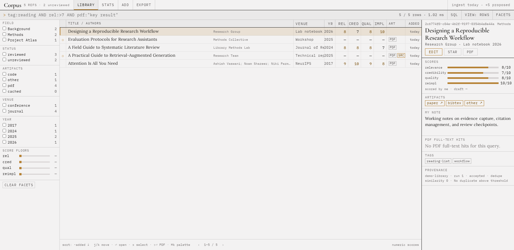

# Corpus

<p align="center">
  
</p>

<p align="center">
  <a href="https://github.com/iSach/corpus/actions/workflows/test.yml"></a>
  <a href="https://github.com/iSach/corpus/releases"></a>
  <a href="LICENSE"></a>
  <a href="https://www.python.org/"></a>
  <a href="#production-deployment"></a>
</p>

Corpus is a single-user, self-hosted research library for collecting, organizing, searching, and reviewing academic papers. Capture metadata from DOI or arXiv, add notes, tags, scores, and artifact links, cache PDFs for page-aware full-text search, and export a library you control.

Organize papers around your own projects with configurable fields. Corpus works for literature reviews, research planning, and ongoing technical reading; it makes no assumptions about your discipline or workflow.



## Highlights

- DOI and arXiv metadata lookup, plus links to PDFs, code, data, slides, and other artifacts.
- Configurable fields, tags, review states, numeric scores, facets, and saved smart lists.
- Fast SQLite FTS5 search across titles, authors, abstracts, notes, tags, and extracted PDF text.
- Boolean query language with score and year filters, sorting, and page-numbered PDF results.
- Background PDF caching and extraction, provenance for imported papers, and near-duplicate detection.
- JSON, CSV, and BibTeX export, a bounded read-only SQL console, and a Bearer-authenticated ingest API for scripts and agents.
- One FastAPI process and SQLite database. No frontend build step or external service dependency.

Corpus is released under the [MIT License](LICENSE). The bundled fonts retain their respective SIL Open Font License notices in `static/fonts/`.

## Run locally

Corpus expects Python 3.10 or newer. From the repository root:

```sh
python3 -m venv .venv
.venv/bin/pip install -r requirements.txt
.venv/bin/python run.py
```

The default bind is `127.0.0.1:8000`. The first normal start creates `data/corpus.sqlite3`, the PDF cache directory, a generated ingest token at `data/ingest-token`, and, when no `CORPUS_PASSWORD` is supplied, a generated login password in `data/initial-credentials.json` with mode `0600`. Read that password once, store it in a password manager, and remove the credentials file when it is no longer needed:

```sh
jq -r .password data/initial-credentials.json
rm data/initial-credentials.json
```

New libraries start with a single `Unfiled` field. Define your own project areas with `CORPUS_FIELDS`; for example:

```sh
export CORPUS_FIELDS='[{"id":"thesis","label":"Thesis"},{"id":"lab-notes","label":"Lab notes"},{"id":"unfiled","label":"Unfiled"}]'
```

An optional, verified 34-paper library is available as a demonstration dataset. It covers simulation-based inference and diffusion models, but it does not define Corpus's default workflow. Run `seed.py` to add it; it is filed under your generic default unless you configure matching field IDs. Seed PDFs remain linked but are not downloaded unless you pass `--cache-pdfs`. The command is idempotent:

```sh
.venv/bin/python seed.py --cache-pdfs
```

PDF full-text search becomes available only after a PDF has been cached and extracted. A failed or pending download is visible in Stats and can be retried from the artifact controls.

For a login-free development session, use a loopback bind explicitly:

```sh
.venv/bin/python run.py --dev --host 127.0.0.1
```

`--dev` and `CORPUS_DEV=1` are rejected on non-loopback binds.

## Configuration

The process reads environment variables directly; it does not load a `.env` file itself. For a local file, use `set -a; . ./.env; set +a` before starting. For production, use the `EnvironmentFile` in `docs/corpus.service`. See [.env.example](.env.example) for a shell-compatible template.

| Variable | Default | Purpose |
| --- | --- | --- |
| `CORPUS_DATA_DIR` | `./data` | SQLite database and generated credentials/token files. |
| `CORPUS_PDF_CACHE` | `$CORPUS_DATA_DIR/pdfs` | Directory for cached PDFs. |
| `CORPUS_CACHE_MAX_BYTES` | `10737418240` | PDF cache quota, 10 GiB by default. |
| `CORPUS_DEDUPE_THRESHOLD` | `0.91` | Fuzzy title/author duplicate threshold, from `0.5` through `1`. Exact DOI and arXiv matches always win. |
| `CORPUS_FIELDS` | one `Unfiled` field | JSON list of `{ "id": ..., "label": ... }` field definitions. Define your own project areas; existing field IDs are retained when labels change. |
| `CORPUS_PASSWORD` | empty | Login password. Set this in production to avoid generated credentials; changing it and restarting rotates the stored password and ends in-memory sessions. |
| `CORPUS_INGEST_TOKEN` | generated file token | Bearer token for `POST /api/ingest`. If omitted, the token is generated in `data/ingest-token` with mode `0600`. |
| `CORPUS_SQL_LOCAL_ONLY` | `0` | Set to `1` to allow the SQL console only when the resolved client address is loopback. |
| `CORPUS_SECURE_COOKIE` | `0` | Set to `1` when the app is served through HTTPS. |
| `CORPUS_DEV` | `0` | Disable login for loopback development only. Prefer `run.py --dev`. |

Each PDF download is bounded to 50 MiB, each extracted PDF to 1,000 pages and 20 million characters, and request bodies to 2 MiB. The cache quota is checked before a download begins.

## API overview

The browser uses these routes:

- `GET /api/config`, `GET /api/session`, `POST /api/login`, and `POST /api/logout` handle configuration and the seven-day in-memory session cookie.
- `GET /api/papers` searches the library; `GET /api/paper?id=...` returns detail, provenance, and PDF hits; `POST /api/papers` creates or updates a paper; `POST /api/duplicates` returns near-duplicate candidates.
- `POST /api/metadata` fetches DOI or arXiv metadata; it accepts an identifier or source URL containing one of those identifiers.
- `GET /api/stats`, `POST /api/export`, and the smart-list routes support review and export workflows. `POST /api/artifacts/{id}/cache` queues a linked or failed PDF from the detail pane; `POST /api/artifacts/{id}/retry` is an alias that supports the same linked/failed states.
- `POST /api/sql` runs a bounded read-only query. SQLite is opened in read-only mode with `query_only`, an authorizer, a 150 ms progress timeout, and a 1,000-row cap. `CORPUS_SQL_LOCAL_ONLY=1` adds a loopback client check.
- `POST /api/ingest` is the agent-facing endpoint and is authenticated with the Bearer token described in [INGEST.md](INGEST.md).

The production systemd and nginx templates are [docs/corpus.service](docs/corpus.service) and [docs/nginx.conf](docs/nginx.conf). They keep Uvicorn on loopback, run one non-root process, and put TLS and the public listener in nginx.

## Query language

The query bar accepts bare terms and these filters:

```text
field:thesis        tag:to-read           venue:ICML  author:Raymond
year:2025           rel:>7                state:unreviewed
has:code            has:pdf              has:cached
is:starred          pdf:"posterior collapse"
sort:rel            sort:-added
```

Bare terms search title, authors, abstract, tags, and notes. Score names are `rel`, `cred`, `qual`, and `reimpl`; score and year filters accept `=`, `<`, `<=`, `>`, and `>=`. `AND`, `OR`, `NOT`, parentheses, and implicit `AND` are supported, with precedence `NOT`, then `AND`/implicit adjacency, then `OR`. A query can contain one top-level sort directive. Score sorts are descending; `added`, `modified`, `year`, `title`, and `venue` follow the requested direction. `pdf:` searches extracted page text and the detail pane reports page-numbered snippets.

Invalid syntax returns a structured error from the API. The client keeps the previous result set and displays the parse message and position, so a mistyped query does not clear the library view.

## Production deployment

Create a dedicated non-root account and directories, install the repository and virtual environment under `/opt/corpus`, and store data under `/var/lib/corpus`:

```sh
sudo useradd --system --home /var/lib/corpus --shell /usr/sbin/nologin corpus
sudo install -d -o corpus -g corpus /var/lib/corpus/data /var/lib/corpus/data/pdfs
sudo install -d -o root -g corpus -m 0750 /etc/corpus
sudo install -o root -g corpus -m 0640 .env.example /etc/corpus/corpus.env
sudoedit /etc/corpus/corpus.env
```

Replace every secret and placeholder in the environment file. Set `CORPUS_SECURE_COOKIE=1` and choose an absolute `CORPUS_DATA_DIR`. Leave `CORPUS_SQL_LOCAL_ONLY=0` when the normal login gate is sufficient. Set it to `1` when the SQL console must be reachable only from loopback: because nginx overwrites `X-Forwarded-For` with the real client address and Uvicorn trusts forwarded headers only from loopback, remote requests through nginx are blocked. Use an SSH tunnel or a local browser on the host for SQL access in that mode. Install and enable the unit:

```sh
sudo install -o root -g root -m 0644 docs/corpus.service /etc/systemd/system/corpus.service
sudo systemctl daemon-reload
sudo systemctl enable --now corpus
sudo journalctl -u corpus -f
```

Copy `docs/nginx.conf` into the nginx site configuration, replace `literature.example.org` and the certificate paths, enable the site, validate it, and reload nginx. The template overwrites `X-Forwarded-For` with `$remote_addr`; this is required because `run.py` trusts forwarded headers only from its loopback proxy. Do not expose port 8000 directly or add public addresses to `forwarded_allow_ips`.

## Backup and restore

Stop Corpus before copying the SQLite database and PDF cache together. This avoids coordinating a live WAL database with files whose extraction status is changing:

```sh
sudo systemctl stop corpus
sudo install -d -m 700 /var/backups/corpus
sudo sqlite3 /var/lib/corpus/data/corpus.sqlite3 ".backup '/var/backups/corpus/corpus.sqlite3'"
sudo tar -C /var/lib/corpus/data -czf /var/backups/corpus/pdfs.tgz pdfs
sudo cp -a /var/lib/corpus/data/ingest-token /var/backups/corpus/ingest-token
sudo systemctl start corpus
```

The SQLite backup can also be made with Python's `Connection.backup()` API. Keep the database backup and matching PDF cache archive from the same stopped-server window. Protect both backups because the token file authorizes agent writes.

The `sqlite3`, `tar`, and `cp` commands above copy files without printing database or token contents. If `CORPUS_PASSWORD` or `CORPUS_INGEST_TOKEN` lives in `/etc/corpus/corpus.env`, preserve that file through a protected secret-backup mechanism rather than echoing its values; retain restrictive file permissions.

To restore, stop the service, replace `corpus.sqlite3` and the `pdfs` directory from the matching backup, restore the token if agent continuity matters, fix ownership to `corpus:corpus`, and start the service. Do not restore while the process is running; remove stale `corpus.sqlite3-wal` and `corpus.sqlite3-shm` files only after confirming they are from the old stopped instance.
